# Single File Section Cards

[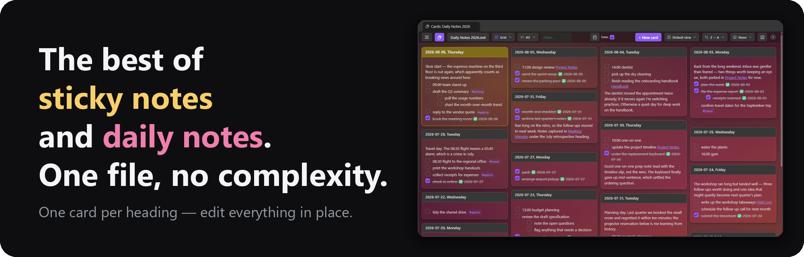](#layouts)

[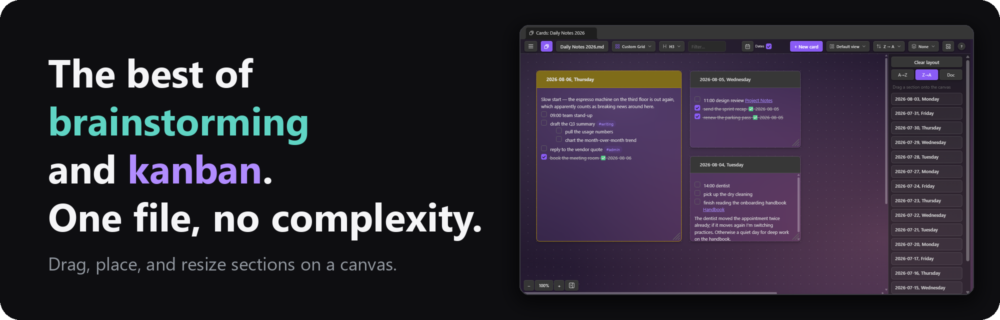](#custom-grid)

[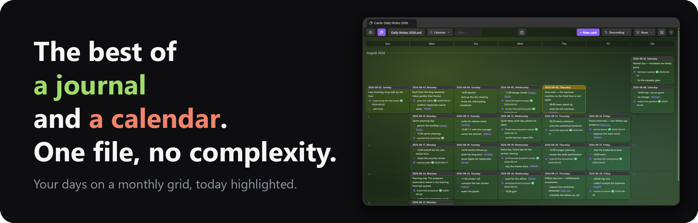](#calendar)

[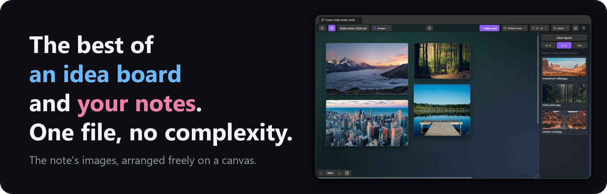](#images)

[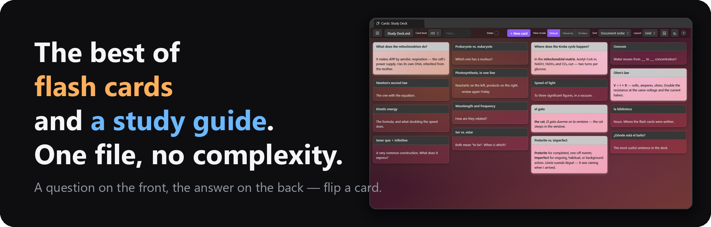](#card-flip)

An [Obsidian](https://obsidian.md) plugin that shows the sections of **one** note as a wall of
cards — one card per heading — and lets you edit any section in place. With many layout and view options, it functions as as a home for ad hoc
dashboards, sticky notes, flash cards, task management, brainstorming, and a diary or journal.

While this is a standalone plugin that works on any note, it pairs nicely with
[Single File Daily Notes](https://github.com/pranavmangal/obsidian-single-file-daily-notes) as well as
[Tasks](https://github.com/obsidian-tasks-group/obsidian-tasks).

**[Install it from the Obsidian community plugin directory →](https://community.obsidian.md/plugins/single-file-section-cards)**
· [Release notes](https://github.com/jordanlong121/singlefilesectioncards/releases)

If this plugin is useful to you, you can support its development:

<a href="https://buymeacoffee.com/zippydo"></a>

## What it does

- **One card per heading.** Pick which level becomes a card (H1–H6). Multiple layouts, sort
  orders, and per-card colors.
- **Work directly on the cards.** Click a card to edit its markdown, tick task checkboxes (with
  optional `✅` done dates), quick-add text or delete it. Pinned cards stay at the top.
- **Drag and drop.** Reorder cards, or drag a task, paragraph, or image onto another card.
- **Plays with the [Tasks](https://github.com/obsidian-tasks-group/obsidian-tasks) plugin.**
  Ticking a checkbox uses its toggle (recurring tasks recur), and the right-click menu gains its
  create/edit dialogs.
- **Flash cards.** A marker line splits a section into a front and a back; the card's flip
  button turns it over to the answer, definition, or notes behind (see [Card Flip](#card-flip)).
- **Make it yours.** Apply custom card colors and background images (remembered per note),
  and tune the look with the [Style Settings](https://github.com/mgmeyers/obsidian-style-settings) plugin.
- **Navigate as cards.** Wikilinks open the linked note's card wall, the ↗ button opens the section in a
  normal editor.
- **Templates and dates.** New cards can start from a template note.
- **Deck.** The toolbar's deck button (or `D`) flips the view to thumbnails of your pinned
  and most recent card notes — click one to hop over.
- **Pick or create a note.** The toolbar's note button (or `O`) opens a picker of recent notes
  that searches the vault as you type. Type a title that isn't a note yet and the last row
  offers to create it (`Shift+Enter`, or the footer's "Create new note…" button), in Obsidian's default new-note folder —
  or include a `folder/` to place it.
- **Keyboard shortcuts.** `1`–`6` heading level, `L` layouts, `V` view modes, `D` deck,
  `,`/`.` previous/next heading, `N` new card, `O` pick a note, `S` starred lines only,
  `Ctrl/⌘+F` filter. Click `?` to show keyboard shortcuts.

## Layouts

### Vertical

Full-height cards side by side.


### Custom Grid

A freeform canvas: drag sections on from the tray, then place, move, and resize them.
The arrangement is remembered per note in the plugin's data — never in your notes.


### Images

The same canvas for the note's images and videos — a reference or idea board built
from what the note already links. Hover a preview to magnify it or open the original;
right-click to copy, cut, delete, or paste.

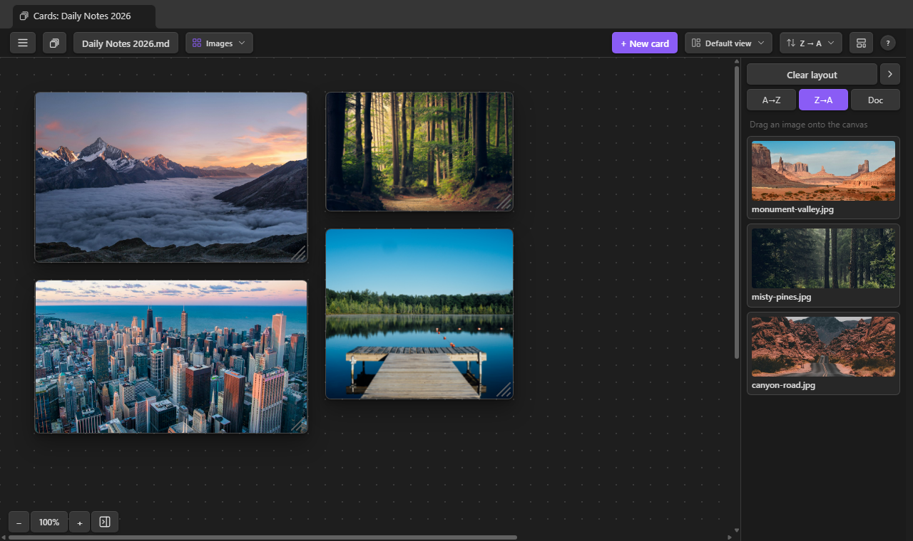

### Grid

Masonry columns: every card takes only the height it needs.


### Grid Aligned

A uniform grid — every row starts at the same height, with a rule between rows.


### Tight

The same masonry packing, denser: narrower columns, smaller gaps and type.


### Tasks Only

Each card shows only its task lines, ordered by date, `#tag`, or task count, with an
open/done filter and a per-card count badge. Editing still opens the section's full text.

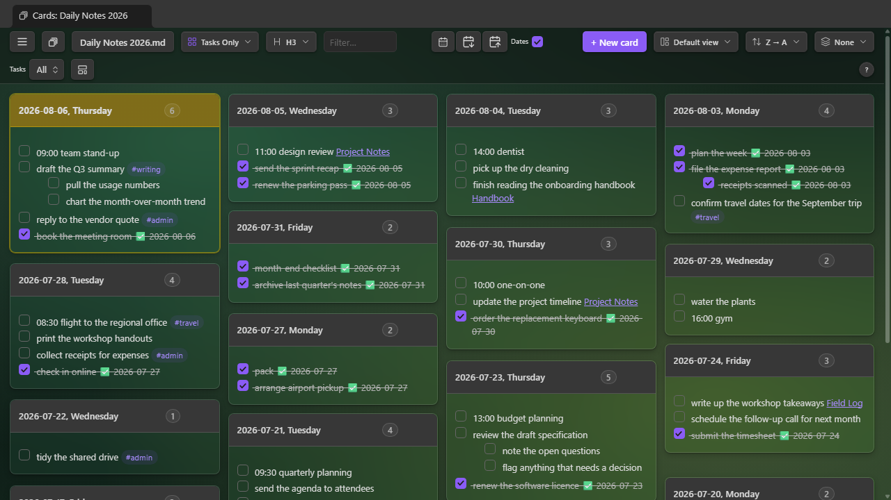

### Horizontal

One card per row, full pane width.


### Calendar

Date cards on a monthly grid, today highlighted. Click an empty day to start its card,
or drag a card onto another day to move it. Needs date headings.


### Heatmap

A year-at-a-glance graph of the dated cards, shaded by tasks done, with streak stats
above. Click a day to open (or create) its card. Needs date headings.

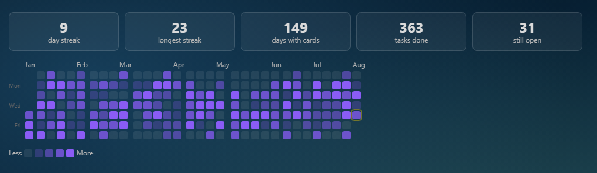

### Links

The canvas for the note's web links: placed tiles show a live page preview. The
magnifier opens the page big and interactive; ↗ opens it in your browser.

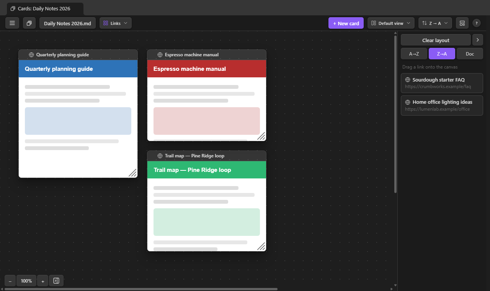

### Hierarchy & Dividers

The toolbar's **View mode** toggle groups cards by the headings above the card level, in any
layout except the Custom Grid canvas. **Hierarchy** adds drill-down columns on the left — click
a heading to see its branch, with card and open-task counts per row. **Dividers** keeps one
wall, split by a collapsible bar per ancestor heading; the count at the bar's right end shows
the group's size. In either mode, `,` and `.` step to the previous/next heading — switching the
selected column row in Hierarchy, scrolling the previous/next bar to the top in Dividers.


## On mobile

The plugin works reasonably well on iOS devices, though it isn't fully tested there
yet. The **Horizontal** layout in particular makes an excellent way to input data
while on the go: one full-width card per section, with quick add, checkboxes, and
in-place editing a thumb-tap away.

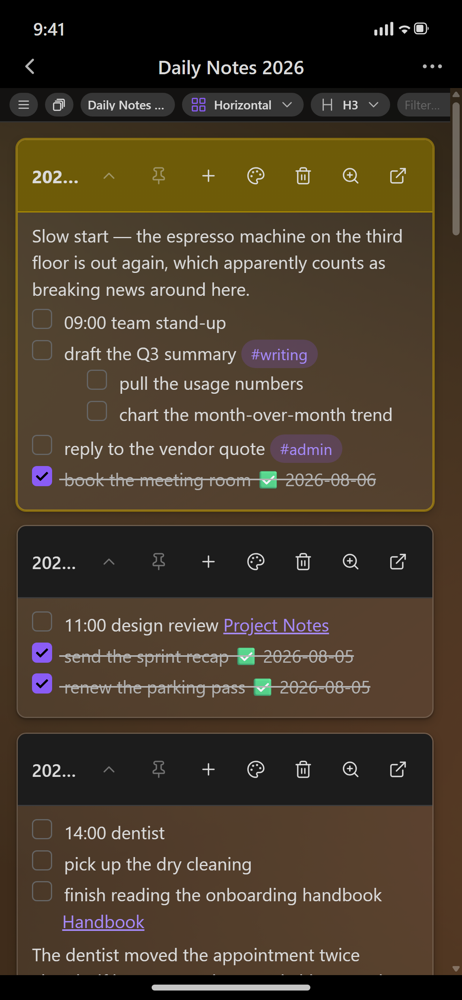

## Brainstorming with cards

A single note makes a whole brainstorm: one `###` heading per theme, and the wall becomes your
sticky notes (`sample-vault/Brainstorm.md` is this example).


Then switch to Custom Grid and arrange: cluster related themes, size cards by importance, and
leave the "later" cards in the list on the right. Drag tasks between cards.


## The right-click menu

Right-click a task or paragraph on a card (long-press on mobile) for a menu.


- **Move line to previous / next card** — sends the block to the neighbouring card in the
  current sort order
- **Move line to today** — on a dated note, sends the block to today's card, creating it first
  if the note doesn't have one yet
- **Edit line…** — opens the block in a small edit window, in the same live-preview (or
  source/plain) editor mode cards use; double-clicking the line opens it too
- **Mark done / Mark undone** — ticks or unticks the task where it sits
- **Copy / Cut line** — puts the block on the clipboard; Cut also removes it from the section
- **Paste below** — inserts the clipboard contents after the block (from a card's empty space,
  **Paste at end** appends to the card instead)
- **Add star / Remove star** — marks the line with the star emoji, for the toolbar's
  starred-only view (see [Filter and starred lines](#filter-and-starred-lines))
- **Delete line** — removes the block (and sub-items) from the section

## Working with the Tasks plugin

When [Tasks](https://github.com/obsidian-tasks-group/obsidian-tasks) is installed and enabled,
the integration switches on by itself:

- **Ticking a checkbox goes through Tasks**, so recurring tasks spawn their next occurrence and
  done dates follow your Tasks settings. (The "Toggle tasks with the Tasks plugin" setting, on
  by default.)
- **Edit task (Tasks)…** — the right-click menu opens a task in Tasks' edit dialog (via a
  normal editor, since Tasks edits at a cursor).
- **New task (below) (Tasks)…** — Tasks' create dialog, inserting the finished line below the
  clicked block, or at the section's end from a card's empty space.

Without Tasks, the menu omits those entries and this plugin's own toggle applies — with the
optional `✅ YYYY-MM-DD` done date.

## Pinned cards

Every card's title bar has a pin button (click again to unpin). Pinning pulls the card into a
pinned section at the top of the wall regardless of sort order, remembered per note across
layouts, views, and restarts.

## Filter and starred lines

The toolbar's filter box (`Ctrl/⌘+F`) narrows the wall to cards containing the typed text;
`Esc` clears it. For longer-lived highlighting, right-click a line and pick **Add star** —
the star emoji is written into the note as plain text, and the toolbar's star toggle (key
`S`) then shows only the starred lines.

## The Deck

The toolbar's deck button (or `D`) flips the view to thumbnails of your card notes —
pinned ones first, then the most recently opened — each with the note's first lines
and its layout. Click one to hop over; the Sort dropdown reorders them by recency,
file name, or the file's modified/created time.

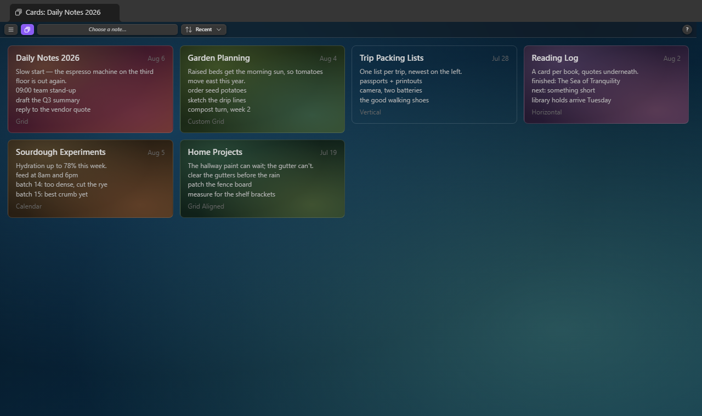

## Manage notes

The ☰ menu's **Manage notes…** (also a command) lists every note the plugin remembers
a cards view for — searchable, pinned notes first, each with its heading level and
layout. Click a note to open it, or use the row's buttons: pin it into the right-click
menu's quick switch, rename it (links update), duplicate it with its view settings,
forget the remembered view, or delete the note.

## The menu, and per-note backgrounds

The ☰ button at the toolbar's left end collects the per-note controls, including
**Background**: give the note's card wall an image — from the vault, your computer, or a
URL (downloaded once into the attachment folder) — with live sliders for transparency,
brightness, and saturation, all remembered per note. That one URL download is the plugin's
only network access; everything else works fully offline.

## Style Settings

With the [Style Settings](https://github.com/mgmeyers/obsidian-style-settings) plugin
installed, **Settings → Style Settings → Single File Section Cards** offers visual knobs:
card gap, column width, wall padding, card surface strength per theme, a flat (shadowless)
card toggle, calendar day-cell height, and the default background-image veil. Without
Style Settings everything simply uses the defaults.

## Card colors

Every card's title bar has a palette button offering nine colors, which tint the card's border and
title bar in every layout. Colors are remembered per note in the plugin's data.

## Card Flip

A card can have two faces. Put a **back-side marker** line in a section and everything above it
is the card's front, everything below it the card's back — hidden until you turn the card over.
Use it for a study prompt with the answer behind it, a term and its definition, or a card's
notes, sources, and metadata kept out of the way until wanted.

```markdown
### Capital of France?

%% flip %%
Paris — since 508, with a gap for Vichy.
```

**Turning a card.** Cards that hold the marker get a flip button (a horizontal loop arrow) at the
end of the title bar's action strip, and a matching **Flip the card over** item in the title bar's
right-click menu; cards without a marker show neither. The showing face slides out and the
other slides in from the far side — leftward to the back, rightward home; the button lights up in the accent color while the back is showing, and
the same button or menu item turns it back. A flipped card also inverts its colors — a light card
goes dark and vice versa, with its hue kept — so a card on its back is obvious at a glance, even
in a wall of cards. Pictures on the back still look like themselves. Flipping never changes a
card's size: the back is given exactly the front's height, scrolls if it's longer, and the rest
of the layout stays put. Reduced-motion systems get the swap without the slide.

**What the back can hold.** Anything markdown: paragraphs, lists, links, images, embeds, code.
The back renders on the first flip and stays rendered after. It is read-only display — click the
card to edit the whole section, front and back together, in the usual card editor (which always
opens on the front, uninverted). Tasks written on the back are not tickable from the back, but
they still count in the Tasks layout and the filter box, which read the whole section. Making a
flipped card big shows its back at full size. The card's quick-add dialog offers **Card front**
and **Card back** rows, each with its own *Add to top* and *Add to bottom*, so a line lands on the
face you mean without opening the editor.

**The marker.** The default `%% flip %%` is an Obsidian comment, so the note's own reading view
hides it too. Matching is exact after trimming and ignores case, and a marker quoted inside a
code fence doesn't count. Any text works as the marker (settings → Card Flip → **Back-side
marker**): `---` or `<!-- back -->`, say — pick one that never appears in your sections for another
reason. Leave a blank line above the marker so the last front paragraph stays its own block. Only
the first marker in a section splits the card; a second one is ordinary back text.

**Turning it off.** The **Flip-over button** setting (settings → Card Flip, on by default) removes
the buttons and menu items and renders every section whole, marker line included (invisible when
it's a comment).

## New-card options, per note

The toolbar button beside **+ New card** holds the open note's new-card options: a template
note, and the note's own heading-name format.

## Templates

A template pre-fills the body of every new card, so a daily-notes file can start each day with
the same skeleton. Pick one via the new-card options button ("Choose template note…") — one
template per note, stored in the plugin's data, never in your notes; the button wears the
accent color while one is set. On **+ New card** the template is read, its placeholders filled
in, and the new card opens for editing.

**Placeholders.**

| Placeholder | Becomes |
| --- | --- |
| `{{title}}` | The new card's heading text |
| `{{date}}` / `{{date:FORMAT}}` | The date named in the new heading — today if it names none |
| `{{time}}` / `{{time:FORMAT}}` | The current time |

`FORMAT` is a [moment format string](https://momentjs.com/docs/#/displaying/format/), as in
Obsidian's core Templates. `{{date}}` follows the card, not the clock: back-filling a card for
last Tuesday writes last Tuesday's date.

**Example.** With this template note:

```markdown
- [ ] Standup notes
- [ ] Review {{date:dddd}}'s plan
- [ ] Shutdown checklist ({{title}})
```

creating the card `2026-08-20, Thursday` produces:

```markdown
### 2026-08-20, Thursday
- [ ] Standup notes
- [ ] Review Thursday's plan
- [ ] Shutdown checklist (2026-08-20, Thursday)
```

## Dates, per note

The toolbar's **Dates** checkbox says whether the open note's headings name dates. It governs
the today-card highlight, the jump-to-today scroll, and the calendar button — per note. Until
clicked, it decides from the note itself; click it once and your choice is remembered.

## Jump to a date

With **Dates** on and date headings present, a calendar button appears beside the checkbox.
Pick a date and the view scrolls to that card and flashes it; if no card exists for the date, a
prompt offers to create it (template applied, default placement).

## Usage

- Click the deck-of-cards icon in the ribbon, or run one of the commands:
  - `Single File Section Cards: Open section cards (default note)`
  - `Single File Section Cards: Open section cards for the active note`
  - `Single File Section Cards: Create new card`
- The toolbar button switches notes: your default note, notes you've viewed as cards, and recently
  opened notes lead the list, with the rest of the vault's notes below them — type to search
  everything by name or path.

## Settings

| Setting | What it does |
| --- | --- |
| Default note | Vault-relative path opened by the ribbon icon and command |
| Reopen remembered notes as cards | A note you've viewed as cards before opens in the cards view instead of the editor; a card's ↗ button still reaches the editor (off by default) |
| Heading level | Which heading rank becomes a card (H1–H6) |
| Jump to today's card | Scroll to today's card when a note opens in the view (on by default; needs the note's Dates checkbox) |
| Keep pinned cards on screen | Pinned cards stay on screen while the rest scroll — below the toolbar, or left of the row in Vertical (on by default; not in Custom Grid) |
| Card colors | Each of the nine card colors' RGB value and label, with preset palettes to apply in one pick |
| Card Flip | Flip-over button on cards that hold the back-side marker line; the marker text itself (default `%% flip %%`) |
| Default sort | A→Z, Z→A, or document order |
| Default layout | Grid, Grid Aligned, Tight, Horizontal, Vertical, Custom Grid |
| Show open-task counts in Hierarchy columns | Square badge per column row counting the unfinished tasks beneath it (on by default) |
| Default heading name | Date format used to pre-fill "New card" (any note can set its own from the toolbar's new-card options menu) |
| Default placement | Where a new card is inserted |
| Clicking a card's title bar | Makes the card big (default), or edits the raw markdown |
| Autosave open card editors | Write an open editor's content to the note every few minutes, and when the view closes, so an edit left open isn't lost (on by default) |
| Autosave interval | Minutes between autosaves while a card editor is open (default 5) |
| Toggle tasks with the Tasks plugin | Route checkbox ticks through the [Tasks](https://github.com/obsidian-tasks-group/obsidian-tasks) plugin when it's installed (recurrence, its done dates) |
| Completion date on tasks | Append `✅ YYYY-MM-DD` when a task is ticked |
| Cross out nested items | Whether ticking a task also strikes through the items nested beneath it |
| Star emoji | The emoji "Add star" writes at the start of a line, matched by the starred-only view (default ⭐) |
| Card height | Maximum card height before the body scrolls |

## Install

### From the community plugin directory (recommended)

In Obsidian, open **Settings → Community plugins → Browse**, search for **Single File Section
Cards**, install, and enable. Updates arrive through the normal plugin updater.

### With BRAT (pre-release versions)

To track releases straight from this repository, add `jordanlong121/singlefilesectioncards` as
a beta plugin in [BRAT](https://github.com/TfTHacker/obsidian42-brat).

## FAQ

**Is this vibe-coded?**
Yes!

**Will you maintain this?**
Yes! I use it everyday and want to make it the best I can.

**Are there other plugins like it?**
I don't know, that's why I wrote it.

**Do you need the [Single File Daily Notes](https://github.com/pranavmangal/obsidian-single-file-daily-notes) plugin for this to work?**
No, but you should use it because it's cool.

**Do you need the [Tasks](https://github.com/obsidian-tasks-group/obsidian-tasks) plugin?**
No — checkboxes, done dates, and the right-click menu all work without it. If it's installed,
ticking goes through Tasks (so recurring tasks recur) and the menu gains its create/edit dialogs.

**Do you accept feature or bug fix requests?**
Yes, please open an issue on the [GitHub page](https://github.com/jordanlong121/singlefilesectioncards/issues).

## License

[MIT](LICENSE)
