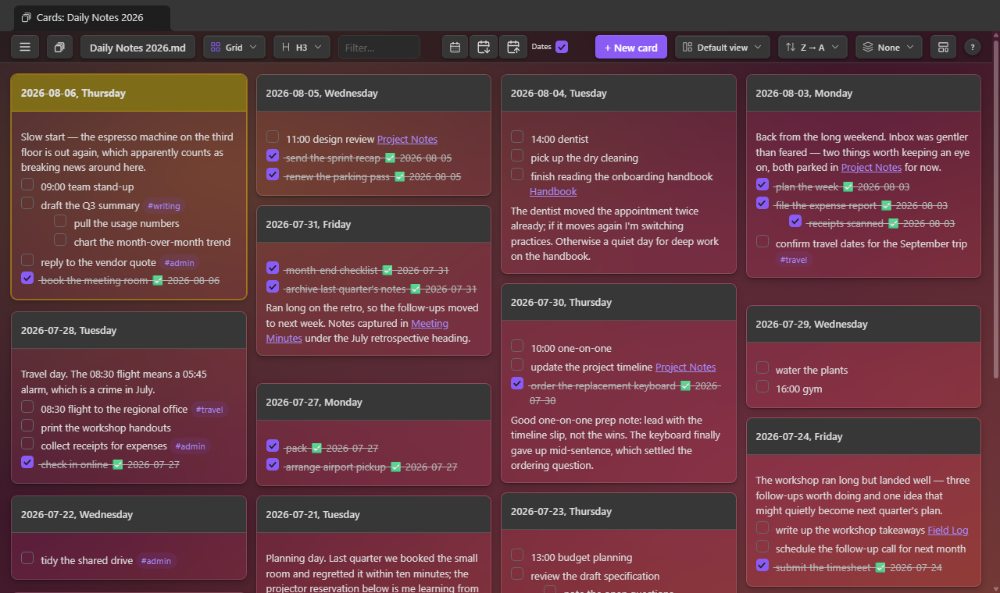
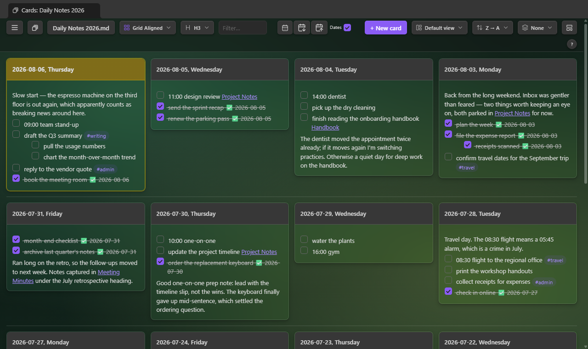
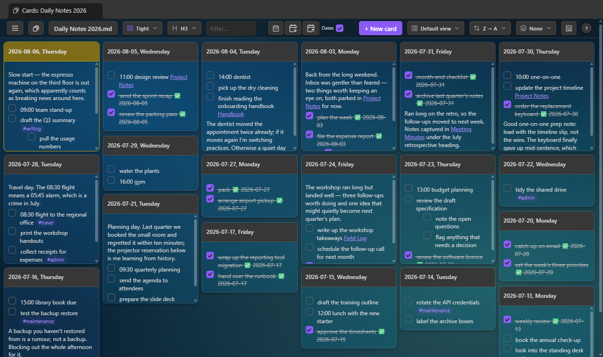
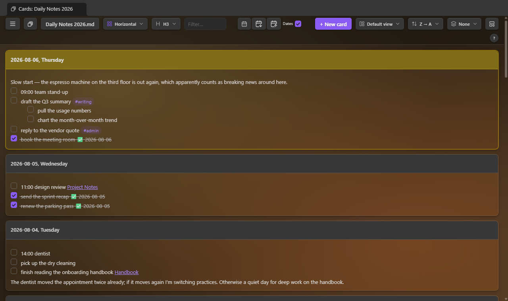
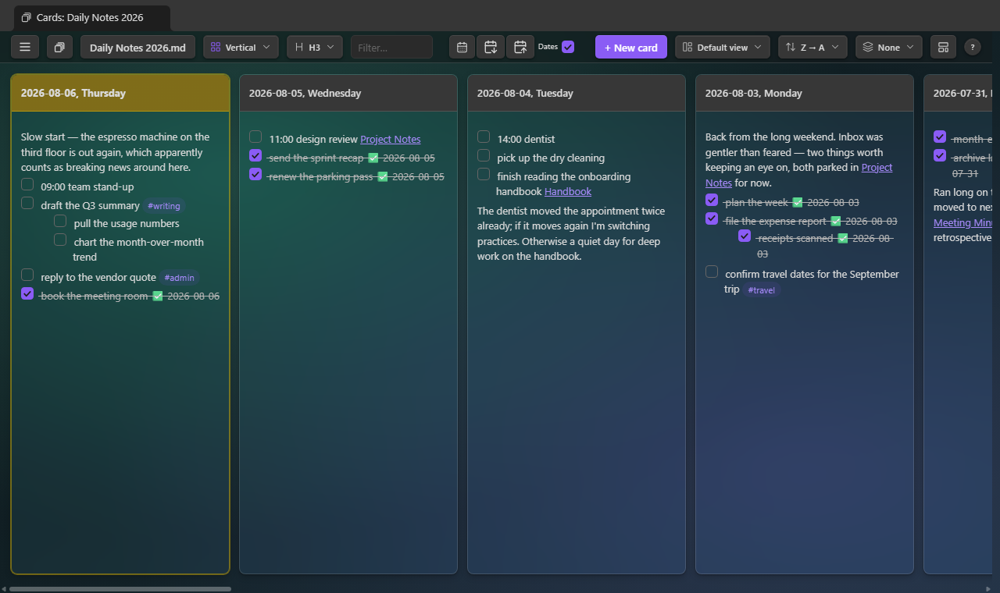

# Single File Section Cards

An [Obsidian](https://obsidian.md) plugin that shows the sections of **one** note as a wall of
cards — one card per heading — and lets you edit any section in place, writing straight back to
the source `.md` file.

> **Made to pair with [Single File Daily Notes](https://github.com/pranavmangal/obsidian-single-file-daily-notes).**
> That plugin keeps a whole year of daily notes in a single file, one `### YYYY-MM-DD` heading per
> day. This plugin turns those headings into a card wall you can scan, sort, and tick off. It works
> on any note with headings, but that's the setup it was built for.



## What it does

- **One card per section.** Choose which heading level becomes a card (H1–H6). Deeper headings stay
  nested inside their parent card; a shallower heading ends a card. Headings inside code fences and
  frontmatter are ignored.
- **Click a card to edit it.** The card body becomes a raw-markdown editor holding the heading and
  its body. `Ctrl/⌘+Enter` saves, `Esc` cancels. Clicking the **title bar** makes the card big by
  default; a setting switches it to opening the editor instead. Only that section's lines are rewritten, and the
  section is re-located at save time so it can't clobber changes made elsewhere in the file.
- **Tick tasks straight from a card.** Clicking a checkbox toggles that task in the file — no edit
  mode. Optionally appends an Obsidian Tasks style done date (`✅ 2026-08-06`).
- **New card.** Prompts for a heading, pre-filled with today's date at the current heading level
  (`### 2026-08-06, Thursday`). Place it at the top, at the bottom, or in logical order — which
  follows the direction the file already runs, so a newest-first daily-notes file puts today on top.
- **Today's card is highlighted** in the theme's highlight colour, when the note's headings are dates.
- **Sorting** — alphanumeric ascending or descending (natural order, so dates sort chronologically),
  or document order.
- **Five layouts**, switchable from the toolbar (see below).
- **Per-note memory.** Layout, heading level and sort are remembered for each note, stored in the
  plugin's own data — never in your notes. Notes with nothing saved open in Grid.
- **⤢ on a card** blows it up over the others, filling most of the tab, so a long section is easy to
  read. Click ⤡, press `Esc`, or click outside the card to shrink it again.
- **↗ on a card** opens the note in a normal editor tab with the cursor on that heading.
- **Wikilinks open as cards.** Clicking a `[[Note]]` link inside a card opens that note in the card
  view using its own remembered view, rather than as a markdown tab. `[[Note#Heading]]` scrolls to
  that heading's card and flashes it. Ctrl/⌘/Shift/Alt-click keeps Obsidian's normal behaviour, and
  external links still open in your browser.
- **Sensible level for new notes.** A note you haven't set a view for opens at your configured
  heading level if it has one, otherwise at whichever level has the most sections — so a note
  without H3s doesn't open as an empty wall.
- Cards refresh when the file changes on disk, and re-pack when the pane resizes.

## Layouts

### Grid

Masonry columns: every card takes only the height it needs, so a short card never leaves dead space
beneath it.


### Grid Aligned

A uniform grid — every row starts at the same height, with a rule between rows.



### Tight

The same masonry packing, denser: narrower columns, smaller gaps and type. Roughly half the scroll
height of Grid on the same note.



### Horizontal

One card per row, full pane width.



### Vertical

Full-height cards side by side. The row scrolls sideways, and the mouse wheel pans it from anywhere
in the view — over the cards or over the toolbar. A card whose content overflows keeps the wheel
until it reaches its end.



## Usage

- Click the deck-of-cards icon in the ribbon, or run one of the commands:
  - `Single File Section Cards: Open section cards (default note)`
  - `Single File Section Cards: Open section cards for the active note`
  - `Single File Section Cards: Create new card`
- The toolbar button switches notes by fuzzy search; the dropdowns set layout, heading level and sort.

## Settings

| Setting | What it does |
| --- | --- |
| Default note | Vault-relative path opened by the ribbon icon and command |
| Heading level | Which heading rank becomes a card (H1–H6) |
| Headings contain | `Dates` highlights today's card; `Non-dates` turns that off |
| Default sort | A→Z, Z→A, or document order |
| Default layout | Grid, Grid Aligned, Tight, Horizontal, Vertical |
| Default heading name | Date format used to pre-fill "New card" |
| Default placement | Where a new card is inserted |
| Clicking a card's title bar | Makes the card big (default), or edits the raw markdown |
| Completion date on tasks | Append `✅ YYYY-MM-DD` when a task is ticked |
| Card height | Maximum card height before the body scrolls |

## Install

Not in the community plugin browser yet, so pick one of these.

### With BRAT (recommended — it keeps itself updated)

[BRAT](https://github.com/TfTHacker/obsidian42-brat) installs plugins straight from GitHub and
updates them as new versions are released.

1. Install **BRAT** (Obsidian42 - BRAT) from Settings → Community plugins → Browse, and enable it.
2. Open the command palette and run **BRAT: Plugins: Add a beta plugin for testing**.
3. Paste this repository:

   ```
   jordanlong121/singlefilesectioncards
   ```

4. Leave the version as *latest* and confirm. BRAT downloads the plugin into your vault.
5. Enable **Single File Section Cards** in Settings → Community plugins.

BRAT then checks for new releases each time Obsidian starts. To update by hand, run
**BRAT: Plugins: Check for updates to all beta plugins**; to stop tracking it, use
**BRAT: Plugins: Remove a beta plugin**.

### Manually

1. Download `main.js`, `manifest.json` and `styles.css` from the latest release (or build them, below).
2. Put them in `<vault>/.obsidian/plugins/single-file-section-cards/`.
3. Reload Obsidian, then enable **Single File Section Cards** in Settings → Community plugins.

## Sample vault

`sample-vault/` is a small flat vault you can open in Obsidian to try the plugin:

- `Daily Notes 2026.md` — a single-file daily notes file in the format Single File Daily Notes
  produces (`## MMMM YYYY` months, `### YYYY-MM-DD, dddd` days), with generic schedule entries
- `Project Notes.md`, `Meeting Minutes.md`, `Field Log.md`, `Handbook.md`, `Reading List.md` —
  filler notes at different heading depths, for trying the H1–H6 selector

The screenshots above were rendered from that vault with the default Obsidian theme.

## Development

```bash
npm install
npm run dev     # esbuild watch → main.js
npm run build   # typecheck + minified production build
npm test        # parser, placement, task-toggle and view-resolution tests
```

Tests run against `sample-vault/Daily Notes 2026.md`, so they exercise the real parsing and
insertion logic on a real file without needing a vault of your own.

`tools/preview-harness.mjs` renders the view's DOM into a standalone HTML file so the CSS can be
checked in a browser against Obsidian's own `app.css` plus any theme — useful because several
layout bugs were only visible with those stylesheets loaded:

```bash
# app.css can be extracted from your Obsidian install
node tools/asar-extract.mjs "<obsidian>/resources/obsidian.asar" app.css
LAYOUT=grid SORT=desc node tools/preview-harness.mjs out/harness.html
```

### Notes for contributors

- Card surfaces are built from `--mono-rgb-0` / `--mono-rgb-100` rather than `--background-*`,
  because glass and transparent themes legitimately set those to `#00000000`, which made every
  card invisible.
- The view scrolls at the `.view-content` level with a sticky toolbar. Nesting an auto-row grid
  inside a height-constrained flex column collapses every grid row to 0px in Chrome.
- Some themes hide every scrollbar globally, so this plugin opts its own scrollbars back in.
- The plugin id is `single-file-section-cards`, but the view type (`section-cards-view`), icon name
  and `section-cards-*` CSS classes keep their original names — Obsidian stores the view type and
  icon in `workspace.json`, so renaming them would break already-open card tabs.

## License

[GPL-3.0](LICENSE)
