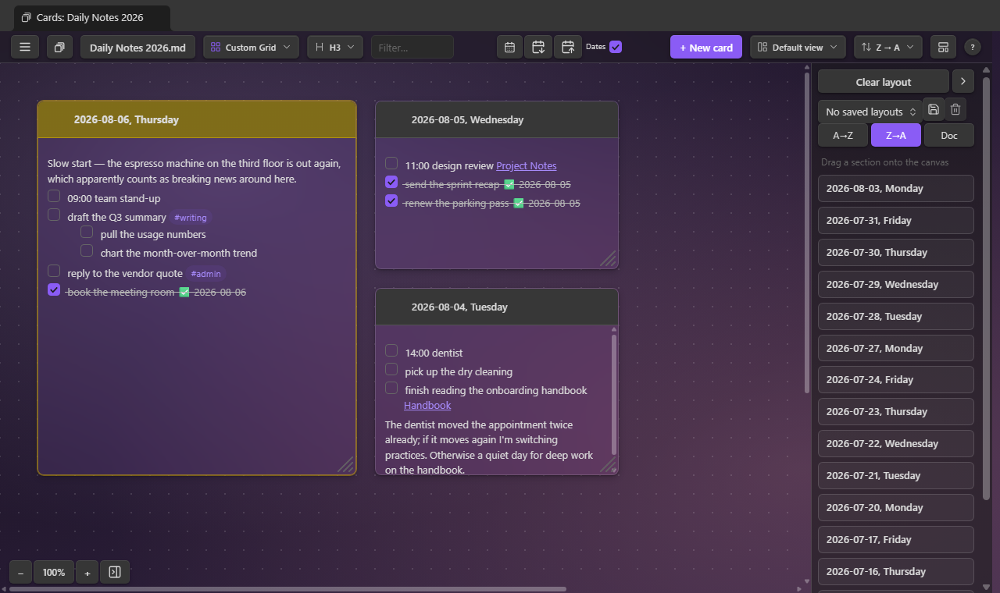
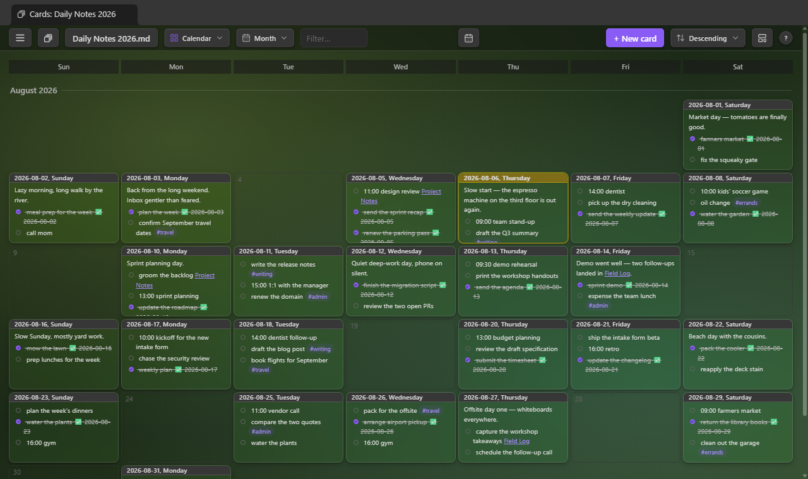
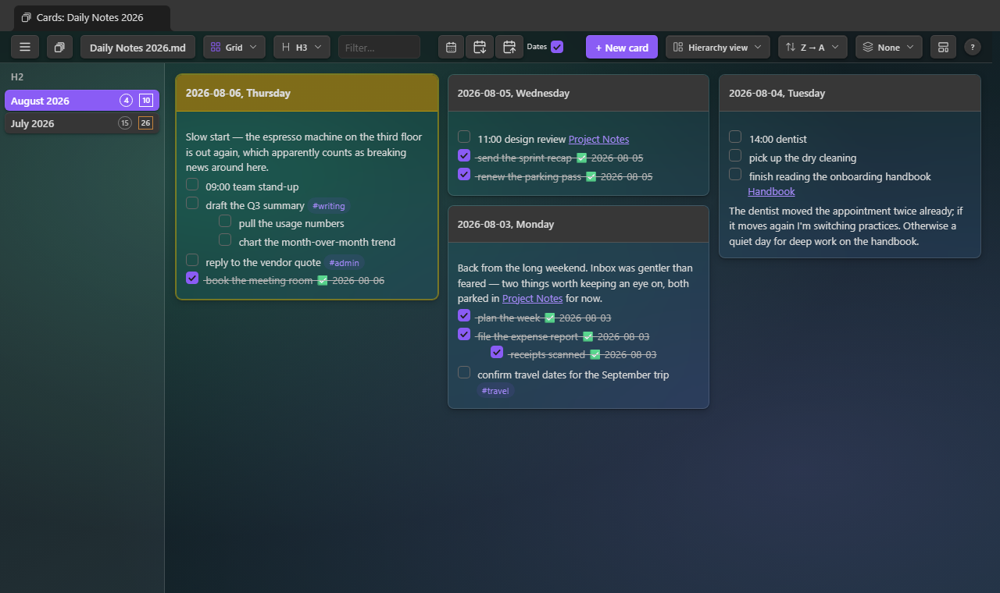
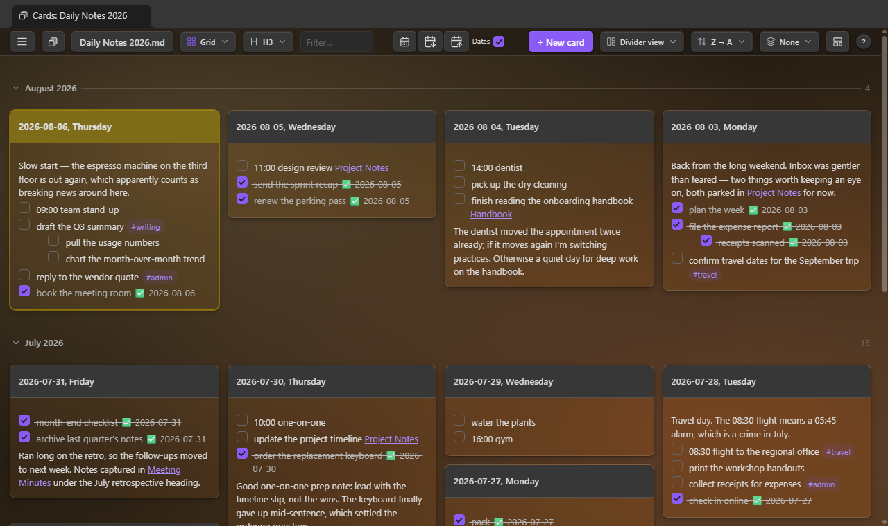
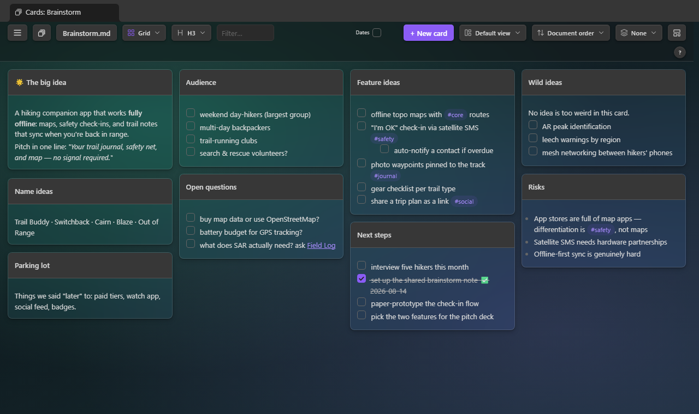
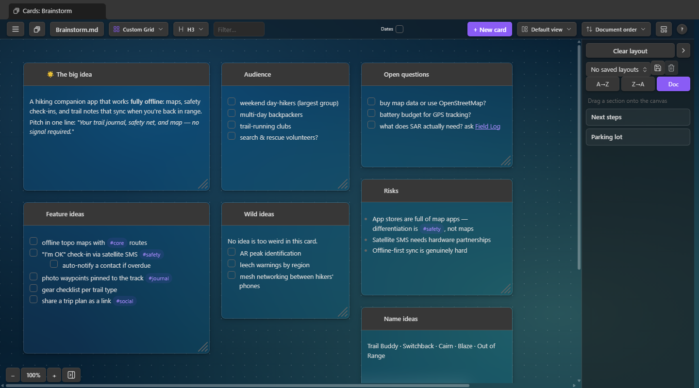
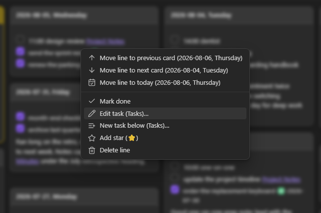

# Single File Section Cards

An [Obsidian](https://obsidian.md) plugin that shows the sections of **one** note as a wall of
cards — one card per heading — and lets you edit any section in place. With the freeform **Custom Grid** canvas, it doubles as a home for ad hoc
dashboards, sticky notes, task management, brainstorming, and a diary or journal — one
dated card per day.

While this is a standalone plugin that works on any note, it pairs nicely with
[Single File Daily Notes](https://github.com/pranavmangal/obsidian-single-file-daily-notes) as well as
[Tasks](https://github.com/obsidian-tasks-group/obsidian-tasks).

**[Install it from the Obsidian community plugin directory →](https://community.obsidian.md/plugins/single-file-section-cards)**
· [Release notes](https://github.com/jordanlong121/singlefilesectioncards/releases)

## What it does

- **One card per heading.** Pick which level becomes a card (H1–H6). Multiple layouts, sort
  orders, and per-card colors.
- **Work directly on the cards.** Click a card to edit its markdown, tick task checkboxes (with
  optional `✅` done dates), quick-add text or delete it. Pinned cards stay at the top.
- **Drag and drop.** Reorder cards, or drag a task or paragraph onto another card.
- **Plays with the [Tasks](https://github.com/obsidian-tasks-group/obsidian-tasks) plugin.**
  Ticking a checkbox uses its toggle (recurring tasks recur), and the right-click menu gains its
  create/edit dialogs.
- **Templates and dates.** New cards can start from a template note.
- **Navigate as cards.** Wikilinks open the linked note's card wall, ↗ opens the section in a
  normal editor.
- **Keyboard shortcuts.** `1`–`6` heading level, `L` layouts, `H`/`D` hierarchy/dividers,
  `,`/`.` previous/next heading, `N` new card, `S` starred lines only, `Ctrl/⌘+F` filter — the toolbar's `?` button
  lists them all.
- **Writes are surgical.** Only the touched section's lines change, re-located by content
  first, so a stale card refuses rather than touching the wrong lines.

## Layouts

### Vertical

Full-height cards side by side.


### Custom Grid

A freeform canvas. Drag sections from the tray on the right onto the dot grid, then place, move,
and resize them however you like — cards snap to the grid; the ✕ (or a drag back
onto the tray) returns one to the list. Layout is remembered per note in the plugin's data — never in your notes.



### Grid

Masonry columns: every card takes only the height it needs, so a short card never leaves dead space
beneath it.


### Grid Aligned

A uniform grid — every row starts at the same height, with a rule between rows.


### Tight

The same masonry packing, denser: narrower columns, smaller gaps and type.


### Horizontal

One card per row, full pane width.


### Calendar

Date cards on a monthly calendar grid — every month between the first and last dated
card, with today highlighted. Needs headings that name dates (the toolbar's Dates
checkbox); the sort control orders the months. Click an empty day to start its card,
or drag a card onto another day to move it there — dropping it on a day that already
has a card offers to merge them.



### Hierarchy & Dividers

The toolbar's **View mode** toggle groups cards by the headings above the card level, in any
layout except the Custom Grid canvas. **Hierarchy** adds drill-down columns on the left — click
a heading to see its branch, with card and open-task counts per row. **Dividers** keeps one
wall, split by a collapsible bar per ancestor heading; the count at the bar's right end shows
the group's size. In either mode, `,` and `.` step to the previous/next heading — switching the
selected column row in Hierarchy, scrolling the previous/next bar to the top in Dividers.





## Brainstorming with cards

A single note makes a whole brainstorm: one `###` heading per theme, and the wall becomes your
sticky notes (`sample-vault/Brainstorm.md` is this example).



Then switch to Custom Grid and arrange: cluster related themes, size cards by importance, and
leave the "later" cards in the list on the right. Drag tasks between cards.



## The right-click menu

Right-click a task or paragraph on a card (long-press on mobile) for a menu.



- **Move line to previous / next card** — sends the block to the neighbouring card in the
  current sort order
- **Move line to today** — on a dated note, sends the block to today's card, creating it first
  if the note doesn't have one yet
- **Mark done / Mark undone** — ticks or unticks the task where it sits
- **Add star / Remove star** — marks the line with the star emoji, for the toolbar's
  starred-only view (see [Filter and starred lines](#filter-and-starred-lines))
- **Delete line** — removes the block (and sub-items) from the section

## Working with the Tasks plugin

When [Tasks](https://github.com/obsidian-tasks-group/obsidian-tasks) is installed and enabled,
the integration switches on by itself:

- **Ticking a checkbox goes through Tasks**, so recurring tasks spawn their next occurrence and
  done dates follow your Tasks settings. (The "Toggle tasks with the Tasks plugin" setting, on
  by default.)
- **Edit task (Tasks)…** — the right-click menu opens a task in Tasks' edit dialog (via a
  normal editor, since Tasks edits at a cursor).
- **New task (below) (Tasks)…** — Tasks' create dialog, inserting the finished line below the
  clicked block, or at the section's end from a card's empty space.

Without Tasks, the menu omits those entries and this plugin's own toggle applies — with the
optional `✅ YYYY-MM-DD` done date.

## Pinned cards

Every card's title bar has a pin button (click again to unpin). Pinning pulls the card into a
pinned section at the top of the wall regardless of sort order, remembered per note across
layouts, views, and restarts.

## Filter and starred lines

The toolbar's filter box (`Ctrl/⌘+F`) narrows the wall to cards containing the typed text —
title or body, case-insensitive; `Esc` clears it.

For a longer-lived kind of highlighting, right-click any task or paragraph and pick **Add
star**: the star emoji (configurable in settings) is written at the start of the line — plain
text in your note, so it survives edits, drags, sync, and shows in the normal editor too.
Once a note has a starred line, a star button appears beside the filter box (key `S`): toggle
it to see only the starred lines, on only the cards that hold one. Cards where the starred-only
view hid something end in a faint `…`, and both filters combine. **Remove star** on the same
menu takes the mark back off.

## The menu, and per-note backgrounds

The ☰ button at the toolbar's left end collects the per-note controls in one place: the
Dates toggle, jump-to-date, and the new-card options (all still on the toolbar too). It's
also where **Background** lives: give the note's card wall a background image, remembered
per note in the plugin's data.

- **Select background…** — one dialog, three sources: an image already **in your vault**,
  any image **on your computer** (a copy is saved into the vault's attachment folder so it
  travels with the vault), or an image URL **from the internet**, downloaded **once** into
  the attachment folder and shown from there — nothing loads from the network afterwards.
- **Transparency** — a slider right in the menu that fades the image toward the page
  color, previewed live as you drag; the strength is remembered per note.
- **Remove background** — back to the plain background.

> **Network use:** this download is the plugin's only network access. It only ever happens
> when you click **Download** in that dialog, and only fetches the URL you entered.
> Everything else works fully offline.

## Style Settings

With the [Style Settings](https://github.com/mgmeyers/obsidian-style-settings) plugin
installed, **Settings → Style Settings → Single File Section Cards** offers visual knobs:
card gap, column width, wall padding, card surface strength per theme, a flat (shadowless)
card toggle, calendar day-cell height, and the default background-image veil. Without
Style Settings everything simply uses the defaults.

## Card colors

Every card's title bar has a palette button offering nine colors, which tint the card's border and
title bar in every layout. Colors are remembered per note in the plugin's data.

## New-card options, per note

The toolbar button beside **+ New card** holds the open note's new-card options: a template
note, and the note's own heading-name format.

## Templates

A template pre-fills the body of every new card, so a daily-notes file can start each day with
the same skeleton. Pick one via the new-card options button ("Choose template note…") — one
template per note, stored in the plugin's data, never in your notes; the button wears the
accent color while one is set. On **+ New card** the template is read, its placeholders filled
in, and the new card opens for editing.

**Placeholders.**

| Placeholder | Becomes |
| --- | --- |
| `{{title}}` | The new card's heading text |
| `{{date}}` / `{{date:FORMAT}}` | The date named in the new heading — today if it names none |
| `{{time}}` / `{{time:FORMAT}}` | The current time |

`FORMAT` is a [moment format string](https://momentjs.com/docs/#/displaying/format/), as in
Obsidian's core Templates. `{{date}}` follows the card, not the clock: back-filling a card for
last Tuesday writes last Tuesday's date.

**Example.** With this template note:

```markdown
- [ ] Standup notes
- [ ] Review {{date:dddd}}'s plan
- [ ] Shutdown checklist ({{title}})
```

creating the card `2026-08-20, Thursday` produces:

```markdown
### 2026-08-20, Thursday
- [ ] Standup notes
- [ ] Review Thursday's plan
- [ ] Shutdown checklist (2026-08-20, Thursday)
```

## Dates, per note

The toolbar's **Dates** checkbox says whether the open note's headings name dates. It governs
the today-card highlight, the jump-to-today scroll, and the calendar button — per note. Until
clicked, it decides from the note itself; click it once and your choice is remembered.

## Jump to a date

With **Dates** on and date headings present, a calendar button appears beside the checkbox.
Pick a date and the view scrolls to that card and flashes it; if no card exists for the date, a
prompt offers to create it (template applied, default placement).

## Usage

- Click the deck-of-cards icon in the ribbon, or run one of the commands:
  - `Single File Section Cards: Open section cards (default note)`
  - `Single File Section Cards: Open section cards for the active note`
  - `Single File Section Cards: Create new card`
- The toolbar button switches notes: your default note, notes you've viewed as cards, and recently
  opened notes lead the list, with the rest of the vault's notes below them — type to search
  everything by name or path.

## Settings

| Setting | What it does |
| --- | --- |
| Default note | Vault-relative path opened by the ribbon icon and command |
| Reopen remembered notes as cards | A note you've viewed as cards before opens in the cards view instead of the editor; a card's ↗ button still reaches the editor (off by default) |
| Heading level | Which heading rank becomes a card (H1–H6) |
| Jump to today's card | Scroll to today's card when a note opens in the view (on by default; needs the note's Dates checkbox) |
| Keep pinned cards on screen | Pinned cards stay on screen while the rest scroll — below the toolbar, or left of the row in Vertical (on by default; not in Custom Grid) |
| Card colors | Each of the nine card colors' RGB value and label, with preset palettes to apply in one pick |
| Default sort | A→Z, Z→A, or document order |
| Default layout | Grid, Grid Aligned, Tight, Horizontal, Vertical, Custom Grid |
| Show open-task counts in Hierarchy columns | Square badge per column row counting the unfinished tasks beneath it (on by default) |
| Default heading name | Date format used to pre-fill "New card" (any note can set its own from the toolbar's new-card options menu) |
| Default placement | Where a new card is inserted |
| Clicking a card's title bar | Makes the card big (default), or edits the raw markdown |
| Autosave open card editors | Write an open editor's content to the note every few minutes, and when the view closes, so an edit left open isn't lost (on by default) |
| Autosave interval | Minutes between autosaves while a card editor is open (default 5) |
| Toggle tasks with the Tasks plugin | Route checkbox ticks through the [Tasks](https://github.com/obsidian-tasks-group/obsidian-tasks) plugin when it's installed (recurrence, its done dates) |
| Completion date on tasks | Append `✅ YYYY-MM-DD` when a task is ticked |
| Cross out nested items | Whether ticking a task also strikes through the items nested beneath it |
| Star emoji | The emoji "Add star" writes at the start of a line, matched by the starred-only view (default ⭐) |
| Card height | Maximum card height before the body scrolls |

## Install

### From the community plugin directory (recommended)

In Obsidian, open **Settings → Community plugins → Browse**, search for **Single File Section
Cards**, install, and enable. Updates arrive through the normal plugin updater.

### With BRAT (pre-release versions)

To track releases straight from this repository, add `jordanlong121/singlefilesectioncards` as
a beta plugin in [BRAT](https://github.com/TfTHacker/obsidian42-brat).

## FAQ

**Is this vibe-coded?**
Yes!

**Will you maintain this?**
Yes! I use it everyday and want to make it the best I can.

**Are there other plugins like it?**
I don't know, that's why I wrote it.

**Do you need the [Single File Daily Notes](https://github.com/pranavmangal/obsidian-single-file-daily-notes) plugin for this to work?**
No, but you should use it because it's cool.

**Do you need the [Tasks](https://github.com/obsidian-tasks-group/obsidian-tasks) plugin?**
No — checkboxes, done dates, and the right-click menu all work without it. If it's installed,
ticking goes through Tasks (so recurring tasks recur) and the menu gains its create/edit dialogs.

## License

[MIT](LICENSE)
