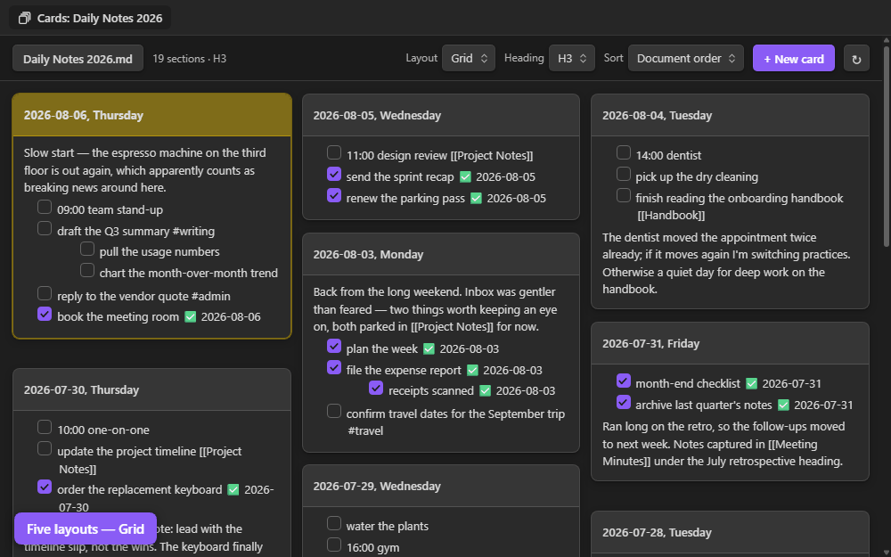

# Single File Section Cards

An [Obsidian](https://obsidian.md) plugin that shows the sections of **one** note as a wall of
cards — one card per heading — and lets you edit any section in place, writing straight back to
the source `.md` file.

> **Made to pair with [Single File Daily Notes](https://github.com/pranavmangal/obsidian-single-file-daily-notes).**
> That plugin keeps all your daily notes in a single file, one `### YYYY-MM-DD` heading per
> day. This plugin turns those headings into a card wall you can scan, sort, and tick off. It works
> on any note with headings, but that's the setup it was built for.

**[Install it from the Obsidian community plugin directory →](https://community.obsidian.md/plugins/single-file-section-cards)**

## What it does

- **One card per heading.** Pick which level becomes a card (H1–H6); deeper headings stay nested
  inside their parent card. Five layouts, three sort orders (A→Z, Z→A, document), today's card
  highlighted when headings are dates — and every note remembers its own view.
- **Work directly on the cards.** Click a card to edit its raw markdown (`Ctrl/⌘+Enter` saves,
  `Esc` cancels, `Tab` indents), tick task checkboxes — with optional `✅ 2026-08-06` done
  dates — create a new card pre-filled with today's date, or delete one after a confirmation.
- **Drag and drop.** Reorder cards in Document order, or drag a task or paragraph onto another
  card in any view — a task brings its sub-items along.
- **Navigate as cards.** Wikilinks switch the tab to the linked note's card wall, ↗ opens the
  section in a normal editor, the four-arrow button blows a card up over the others, and you can
  open as many cards tabs as you like — including several of the same note.
- **Writes are surgical.** Only the touched section's lines change, and every write re-locates
  its section by content first, so a stale card refuses rather than touching the wrong lines.

## Layouts

### Vertical

Full-height cards side by side. The row scrolls sideways, and the mouse wheel pans it from anywhere
in the view — over the cards or over the toolbar. A card whose content overflows keeps the wheel
until it reaches its end.

### Grid

Masonry columns: every card takes only the height it needs, so a short card never leaves dead space
beneath it.

### Grid Aligned

A uniform grid — every row starts at the same height, with a rule between rows.

### Tight

The same masonry packing, denser: narrower columns, smaller gaps and type. Roughly half the scroll
height of Grid on the same note.

### Horizontal

One card per row, full pane width.

## Usage

- Click the deck-of-cards icon in the ribbon, or run one of the commands:
  - `Single File Section Cards: Open section cards (default note)`
  - `Single File Section Cards: Open section cards for the active note`
  - `Single File Section Cards: Create new card`
- The toolbar button switches notes: your default note, notes you've viewed as cards, and recently
  opened notes are suggested; any other note can be reached by typing its name or path. (The plugin
  deliberately never enumerates the vault.)

## Settings

| Setting | What it does |
| --- | --- |
| Default note | Vault-relative path opened by the ribbon icon and command |
| Heading level | Which heading rank becomes a card (H1–H6) |
| Headings contain | `Dates` highlights today's card; `Non-dates` turns that off |
| Default sort | A→Z, Z→A, or document order |
| Default layout | Grid, Grid Aligned, Tight, Horizontal, Vertical |
| Default heading name | Date format used to pre-fill "New card" |
| Default placement | Where a new card is inserted |
| Clicking a card's title bar | Makes the card big (default), or edits the raw markdown |
| Completion date on tasks | Append `✅ YYYY-MM-DD` when a task is ticked |
| Cross out nested items | Whether ticking a task also strikes through the items nested beneath it |
| Card height | Maximum card height before the body scrolls |

## Install

### From the community plugin directory (recommended)

The plugin is listed in the
[Obsidian community plugin directory](https://community.obsidian.md/plugins/single-file-section-cards):
in Obsidian, open **Settings → Community plugins → Browse**, search for **Single File Section
Cards**, install, and enable. Updates arrive through Obsidian's normal plugin updater.

### With BRAT (pre-release versions)

To track releases straight from this repository — useful for trying fixes before they reach the
directory — add `jordanlong121/singlefilesectioncards` as a beta plugin in
[BRAT](https://github.com/TfTHacker/obsidian42-brat).

### Manually

1. Download `main.js`, `manifest.json` and `styles.css` from the latest release (or build them, below).
2. Put them in `<vault>/.obsidian/plugins/single-file-section-cards/`.
3. Reload Obsidian, then enable **Single File Section Cards** in Settings → Community plugins.

## Sample vault

`sample-vault/` is a small flat vault you can open in Obsidian to try the plugin:

- `Daily Notes 2026.md` — a single-file daily notes file in the format Single File Daily Notes
  produces (`## MMMM YYYY` months, `### YYYY-MM-DD, dddd` days), with generic schedule entries
- `Project Notes.md`, `Meeting Minutes.md`, `Field Log.md`, `Handbook.md`, `Reading List.md` —
  filler notes at different heading depths, for trying the H1–H6 selector

The screenshots above were rendered from that vault with the default Obsidian theme.

## FAQ

**Is this vibe-coded?**
Yes!

**Will you maintain this?**
Don't know, but I use it every day so probably.

**Are there other plugins like it?**
I don't know, that's why I wrote it.

**Do you need the [Single File Daily Notes](https://github.com/pranavmangal/obsidian-single-file-daily-notes) plugin for this to work?**
No, but you should use it because it's cool.

## License

[MIT](LICENSE)
