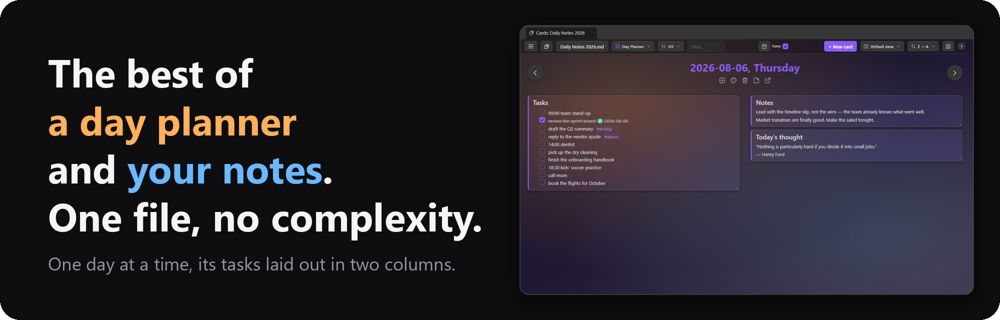
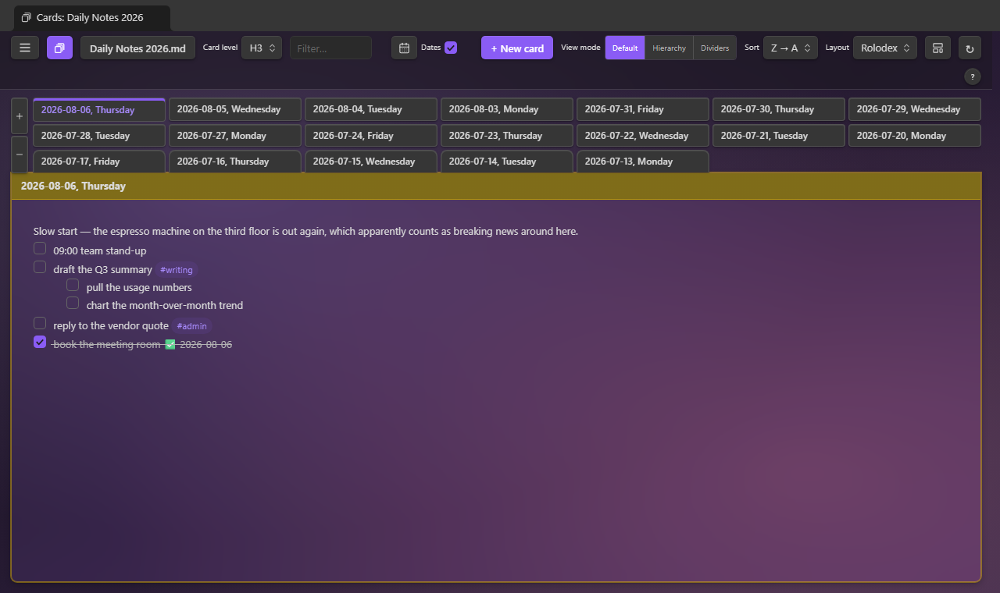
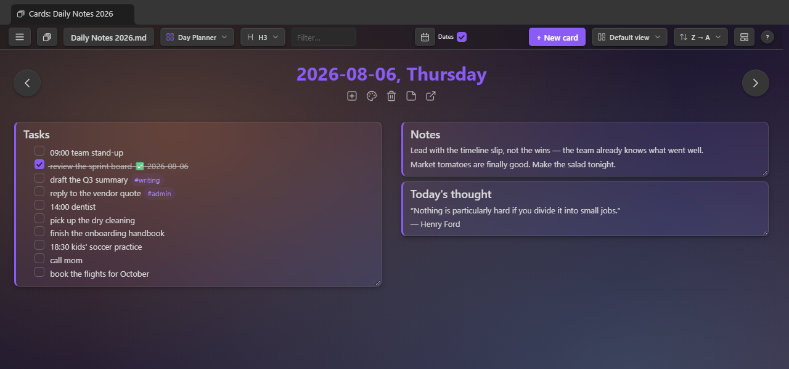
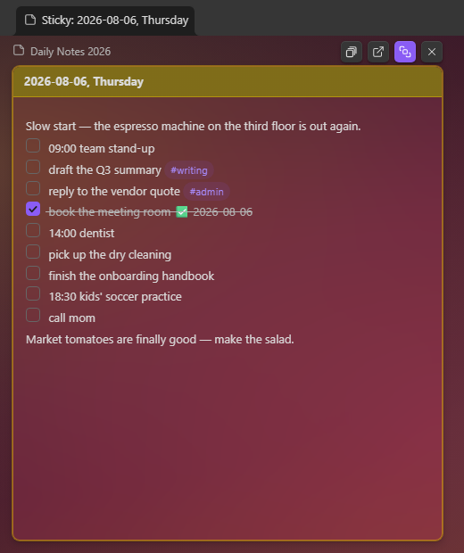

# Single File Section Cards

[](#layouts)

[](#custom-grid)

[](#calendar)

[](#images)

[](#card-flip)

[](#day-planner)

An [Obsidian](https://obsidian.md) plugin that shows the sections of **one** note as a wall of
cards — one card per heading — and lets you edit any section in place. With many layout and view
options, it functions as a home for ad hoc dashboards, a day planner, sticky notes, flash
cards, task management, brainstorming, and a diary or journal.

**Why one big note?** A single file has real advantages over a folder of small ones: an AI
agent can read the whole context in one go, nothing about the structure is locked into a
plugin, and any app that edits Markdown can edit it. The usual price is scrolling — like hunting for
today's section in a year-long note or finding a to-do item in a large project file. This plugin removes that price: the note stays one plain
Markdown file, and you work in the view that fits the job — a wall of cards, a calendar, a day
planner, a canvas — landing on the section you want without scrolling for it.

While this is a standalone plugin that works on any note, it pairs nicely with
[Single File Daily Notes](https://github.com/pranavmangal/obsidian-single-file-daily-notes) as well as
[Tasks](https://github.com/obsidian-tasks-group/obsidian-tasks).

**[Install it from the Obsidian community plugin directory →](https://community.obsidian.md/plugins/single-file-section-cards)**
· [Release notes](https://github.com/jordanlong121/singlefilesectioncards/releases)

If this plugin is useful to you, you can support its development:

<a href="https://buymeacoffee.com/zippydo"></a>

## New in 2.0

- **New note wizard.** ☰ → Note → **New note…** makes a blank note, or one shaped as a Kanban
  board, a SWOT analysis, an Eisenhower matrix, or a GTD system — or a copy of any note in the
  vault. Section names are editable, an Introduction and Additional notes are a toggle each,
  and a one-line hint can sit under every heading. Any note with `cards-preset: true` in its
  properties joins the list as a preset of your own (see [Templates](#templates)).
- **Saved layouts.** Name a Custom Grid arrangement — placements, zoom, and the note's
  background — and switch between the note's saved layouts from the tray, the toolbar's Layout
  picker, or the New note wizard. A changed layout wears an asterisk and asks before it's lost
  (see [Custom Grid](#custom-grid)).
- **A toolbar of pickers.** Layout, Card level, View mode, Sort, and Group are buttons that open
  a grid of icon tiles; the Layout picker sits beside the note's name. The tray beside a canvas
  folds to a slim bar and comes back with a click.
- **The Deck wears backgrounds.** Each tile shows its note's own background, and the Deck has a
  background of its own, apart from any note's.
- **The ☰ menu in two groups**, Card and Note; the Calendar opens on today; editing a card looks
  like the card; the `?` dialog groups its shortcuts.

## What it does

- **One card per heading.** Pick which level becomes a card (H1–H6). Multiple layouts, sort
  orders, and per-card colors.
- **Work directly on the cards.** Click a card to edit its markdown, tick task checkboxes (with
  optional `✅` done dates), quick-add text or delete it. Pinned cards stay at the top.
- **Drag and drop.** Reorder cards, or drag a task, paragraph, or image onto another card.
- **Select many.** Click a title bar to select its card, Shift-click to select a run (or press
  `Ctrl/⌘+A`), then pin, color, flip, move, or delete them together from the bar that appears
  (or a title bar's menu). Ctrl/⌘-click makes a card big. Arrow keys walk the cards; Enter
  edits, Space selects, Shift+arrow extends.
- **Group by.** Divider bars over buckets — first tag, date, open tasks, stars, or length —
  from the toolbar's Group picker. Collapse any card to its title bar; both are remembered.
- **Plays with the [Tasks](https://github.com/obsidian-tasks-group/obsidian-tasks) plugin.**
  Ticking a checkbox uses its toggle (recurring tasks recur), and the right-click menu gains its
  create/edit dialogs.
- **Flash cards.** A marker line splits a section into a front and a back; the card's flip
  button turns it over to the answer, definition, or notes behind (see [Card Flip](#card-flip)).
- **Make it yours.** Apply custom card colors and background images (remembered per note),
  and tune the look with the [Style Settings](https://github.com/mgmeyers/obsidian-style-settings) plugin.
- **Arrange freely, and keep the arrangements.** The Custom Grid canvas places sections where
  you drop them; save an arrangement under a name and switch between saved layouts at will.
- **Navigate as cards.** Wikilinks open the linked note's card wall, the ↗ button opens the section in a
  normal editor.
- **Templates.** New cards can start from a template note, and new notes from the New note
  wizard's built-in structures, your preset notes, or a copy of any note.
- **Deck.** The toolbar's deck button (or `D`) flips the view to thumbnails of your pinned
  and most recent card notes, each wearing its note's background — click one to hop over.
- **Pick or create a note.** The toolbar's note button (or `O`) opens a picker of recent notes
  that searches the vault as you type. Type a title that isn't a note yet and the last row
  offers to create it (`Shift+Enter`, or the footer's "Create new note…" button), in Obsidian's default new-note folder —
  or include a `folder/` to place it.
- **Keyboard shortcuts.** `1`–`6` heading level, `L`/`Shift+L` layouts, `V` view modes, `D` deck, `M` menu,
  `,`/`.` previous/next heading, `N` new card, `O` pick a note, `S` starred lines only,
  `F` flip the card under the pointer, `Shift+F` all cards face up, arrows move the card focus
  (Enter edits, Space selects), `Ctrl/⌘+A` select all, `Ctrl/⌘+F` filter, `Ctrl/⌘+T` a new task
  in a card editor via the Tasks plugin. Click `?` to show keyboard shortcuts.

## Layouts

Pick a layout from the toolbar's **Layout** button beside the note's name — it opens a grid
of every layout, an icon and name each — from the **Layouts** row of the toolbar's ☰ menu or
any right-click menu, or press `L` to cycle (Shift+L backwards). **Card level**, **View mode**, **Sort**, and
**Group** are the same kind of button: an icon, the current choice, and a grid of icon tiles to
pick from. Layouts you never use
in a note can be hidden from it: Ctrl/⌘-click one in the **Layouts** menu and it leaves that
note's dropdown and `L` cycle, staying in the menu dimmed as "(hidden)" — click it there to
bring it back (remembered per note; the layout showing can't be hidden — switch away first).

### Vertical

Full-height cards side by side.


### Custom Grid

A freeform canvas: drag sections on from the tray, then place, move, and resize them.
The arrangement is remembered per note in the plugin's data — never in your notes. The
chevron beside **Clear layout** folds the tray to a slim bar so the canvas takes almost the
whole pane; a click on that bar, the panel button in the zoom controls (bottom-left), or ☰ →
**Show the list beside the canvas** brings it back. The Images and Links canvases fold the same way.
**Saved layouts** (the row beneath) name the current arrangement — placements, zoom, and the
note's background — so a note can switch between, say, a "SWOT" grid and a "Timeline" strip;
pick one from the dropdown to apply it, save again under the same name to update it. Once
the canvas drifts from the applied layout its name wears an asterisk, and clearing the
canvas, switching layouts, or leaving the Custom Grid first asks whether to save. Saved
layouts also appear as tiles in the toolbar's Layout picker, after the layouts, so one is a
click away from any layout; and the New note wizard offers a template note's saved layouts,
so a note made from a template can open on one of them.


### Images

The same canvas for the note's images and videos — a reference or idea board built
from what the note already links. Hover a preview to magnify it or open the original;
right-click to copy, cut, delete, or paste.


### Grid

Masonry columns: every card takes only the height it needs.


### Grid Aligned

A uniform grid — every row starts at the same height, with a rule between rows.


### Tight

The same masonry packing, denser: narrower columns, smaller gaps and type.


### Tasks Only

Each card shows only its task lines, ordered by date, `#tag`, or task count, with an
open/done filter and a per-card count badge. Editing still opens the section's full text.


### Horizontal

One card per row, full pane width.


### Rolodex

One card at a time, filling the pane, with every card's title as a tab across the top — the
strip grows to more rows as titles pile up, and past four it scrolls sideways. Click a tab (or
press `,` / `.`) to turn to that card, drag a tab onto another to move its section there in the
note, or drag a paragraph or task from the card onto a tab to send it to that card.



### Day Planner

One day on one page: the card's title sits across the top with arrows to yesterday and
tomorrow, and each sub-heading directly beneath it is a card of its own in one of two columns,
its tasks and any deeper headings inside (a month shows its weeks, each week its days); loose
lines above the first sub-heading form one card, named after the unfiled card. Drag a card to
the other column or into a new order, resize it, tick its tasks, or send it to the next day by
dropping it on an arrow — the note changes underneath, and the arrangement is remembered per
note. Stepping onto a day with no card offers to create it or to skip to the nearest day that
has one.



#### Document setup

☰ → **Document setup…** says what each heading level of the note holds: nothing, text in
document order, text in alphanumeric order, or a **year**, **month**, **week**, or **day**.
With the toolbar's Dates checkbox on, the defaults are detected from the headings themselves
(“September 2026” at H1 is a month in the “MMMM YYYY” spelling, ISO days at H3 are days); with
it off every level is text. The Day Planner's arrows follow the setup: at a month level → is
the next month and ← the one before, a missing month can be created on the spot, and at an
alphanumeric level the arrows walk the sections A→Z (numbers by value). Saved per note; **Reset
to detected** forgets the saved rows.

### Calendar

Date cards on a monthly grid, today highlighted — the layout opens on today's month, with
today's cell ringed even when it has no card yet. Click an empty day to start its card, or
drag a card onto another day to move it. Needs date headings.


### Heatmap

A year-at-a-glance graph of the dated cards, shaded by tasks done, with streak stats
above. Click a day to open (or create) its card. Needs date headings.


### Links

The canvas for the note's web links: placed tiles show a live page preview. The
magnifier opens the page big and interactive; ↗ opens it in your browser.


### Hierarchy & Dividers

The toolbar's **View mode** toggle groups cards by the headings above the card level, in any
layout except the Custom Grid canvas. **Hierarchy** adds drill-down columns on the left — click
a heading to see its branch, with card and open-task counts per row. **Dividers** keeps one
wall, split by a collapsible bar per ancestor heading; the count at the bar's right end shows
the group's size. In either mode, `,` and `.` step to the previous/next heading — switching the
selected column row in Hierarchy, scrolling the previous/next bar to the top in Dividers.


## On mobile

The plugin works reasonably well on iOS devices, though it isn't fully tested there
yet. The **Horizontal** layout in particular makes an excellent way to input data
while on the go: one full-width card per section, with quick add, checkboxes, and
in-place editing a thumb-tap away.


### Group by

The toolbar's **Group** dropdown puts divider bars over buckets of cards instead of the ancestor
headings: **Tag** (a card's first `#tag`), **Date** (the heading's date, else the latest date in
the body — Upcoming, Today, Yesterday, This week, This month, Older), **Open tasks** (6+, 3–5,
1–2, none), **Stars**, or **Length** (long, medium, short). Cards keep the active sort inside a
bucket; click a bar to collapse its bucket. The choice is remembered per note, like the sort.

## Selecting many cards

Selection works like a file manager: click a card's title bar to select it, Shift-click another
card to select the run between them, `Ctrl/⌘+A` for every visible card, and click empty space (or
press Esc) to clear. Ctrl/⌘-click makes a card big instead.
Changing the sort or grouping keeps the selected card in view. A bar along the bottom then offers **Pin**, **Unpin**,
**Color…**, **Flip** / **Unflip** (two-faced cards), **Rename card…** (rewrites the heading text; pins, colors, and placements follow), and **Delete…**; a title bar's right-click menu
has the same, plus **Move selected before / after this card**. Dragging one selected card drags
them all (document order). Esc clears the selection.

**Keyboard.** The arrow keys move a dashed focus ring to the nearest card in that direction;
Enter opens that card's editor, Space selects or deselects it, and Shift+arrow extends the
selection as it moves. In the Rolodex and the Day Planner, left and right step to the
neighbouring card.

## Collapsing cards

The chevron in a title bar's action strip (or **Collapse card** in its right-click menu) folds a
card to its title bar; click again to open it. Collapsed cards are remembered per note.

## Brainstorming with cards

A single note makes a whole brainstorm: one `###` heading per theme, and the wall becomes your
sticky notes (`sample-vault/Brainstorm.md` is this example).


Then switch to Custom Grid and arrange: cluster related themes, size cards by importance, and
leave the "later" cards in the list on the right. Drag tasks between cards.


## The right-click menu

Right-click a task or paragraph on a card (long-press on mobile) for a menu.


- **Move line to previous / next card** — sends the block to the neighbouring card in the
  current sort order
- **Move line to today** — on a dated note, sends the block to today's card, creating it first
  if the note doesn't have one yet
- **Edit line…** — opens the block in a small edit window, in the same live-preview (or
  source/plain) editor mode cards use; double-clicking the line opens it too
- **Mark done / Mark undone** — ticks or unticks the task where it sits
- **Copy / Cut line** — puts the block on the clipboard; Cut also removes it from the section
- **Paste below** — inserts the clipboard contents after the block (from a card's empty space,
  **Paste at end** appends to the card instead)
- **Add star / Remove star** — marks the line with the star emoji, for the toolbar's
  starred-only view (see [Filter and starred lines](#filter-and-starred-lines))
- **Delete line** — removes the block (and sub-items) from the section

## Working with the Tasks plugin

When [Tasks](https://github.com/obsidian-tasks-group/obsidian-tasks) is installed and enabled,
the integration switches on by itself:

- **Ticking a checkbox goes through Tasks**, so recurring tasks spawn their next occurrence and
  done dates follow your Tasks settings. (The "Toggle tasks with the Tasks plugin" setting, on
  by default.)
- **Edit task (Tasks)…** — the right-click menu opens a task in Tasks' edit dialog (via a
  normal editor, since Tasks edits at a cursor).
- **New task (below) (Tasks)…** — Tasks' create dialog, inserting the finished line below the
  clicked block, or at the section's end from a card's empty space.

Without Tasks, the menu omits those entries and this plugin's own toggle applies — with the
optional `✅ YYYY-MM-DD` done date.

**Ctrl/⌘+T in a card editor** opens the Tasks plugin's dialog for the task on the cursor line, or
creates a new task there — the same as Tasks' own *Create or edit task* command. (The plain-text
editor has no cursor for Tasks to read, so it gets the create dialog and the line drops in at
the cursor.)

**Due-task marks** (settings → Tasks → *Mark cards with due tasks*, on by default): a card with an
open task due today gets an amber pill and edge; one with an overdue task, red. Both Tasks-style
`📅 2026-09-10` dates and Dataview `[due:: 2026-09-10]` fields count.

## Pinned cards

Every card's title bar has a pin button (click again to unpin). Pinning pulls the card into a
pinned section at the top of the wall regardless of sort order, remembered per note across
layouts, views, and restarts.

## Filter and starred lines

The toolbar's filter box (`Ctrl/⌘+F`) narrows the wall to cards containing the typed text;
`Esc` clears it. For longer-lived highlighting, right-click a line and pick **Add star** —
the star emoji is written into the note as plain text, and the toolbar's star toggle (key
`S`) then shows only the starred lines.

## Stickies

Any card can float in a window of its own: click the sticky-note button in its action strip,
or **Open in a sticky window** on its title bar menu. The window shows just that card — tasks,
editing, and all — stays in sync with the note, and can be kept on top of every other window
with the button in its strip. Desktop only.



## The Deck

The toolbar's deck button (or `D`) flips the view to thumbnails of your card notes —
pinned ones first, then the most recently opened — each with the note's first lines,
its layout, and its own background. The Deck has a background of its own too (☰ →
Background while it shows), apart from any note's, and its note picker reads as empty. Click one to hop over; the Sort dropdown reorders them by recency,
file name, or the file's modified/created time. Right-click a tile for **Rename note…**
(links update and the remembered view follows) above Obsidian's own file menu.


## Manage notes

The ☰ menu's **Manage notes…** (also a command) lists every note the plugin remembers
a cards view for — searchable, pinned notes first, each with its heading level and
layout. Click a note to open it, or use the row's buttons: pin it into the right-click
menu's quick switch, rename it (links update), duplicate it with its view settings,
forget the remembered view, or delete the note.

## The menu, and per-note backgrounds

The ☰ button at the toolbar's left end (or `M`) collects the controls in two groups. **Card**:
New card, the note's card template, Flip all cards over and back, Highlight today's card, and
**Background**. **Note**: New note, Manage notes, Document setup, Reload from file, then the
Layouts row, the Dates group, and Settings. In the Deck the note-specific items step aside and
Background edits the Deck's own backdrop.

**Background** gives the note's card wall an image — from the vault, your computer, or a URL
(downloaded once into the attachment folder) — or a generated gradient, with live sliders for
transparency, brightness, and saturation, all remembered per note. That one URL download is the
plugin's only network access; everything else works fully offline.

## Style Settings

With the [Style Settings](https://github.com/mgmeyers/obsidian-style-settings) plugin
installed, **Settings → Style Settings → Single File Section Cards** offers visual knobs:
card gap, column width, wall padding, card surface strength per theme, a flat (shadowless)
card toggle, calendar day-cell height, and the default background-image veil. Without
Style Settings everything simply uses the defaults.

## Card colors

Every card's title bar has a palette button offering nine colors, which tint the card's border and
title bar in every layout. Colors are remembered per note in the plugin's data.

## Card Flip

A card can have two faces. Put the **back-side marker** on its own line and everything above it is
the card's front, everything below its back — a study question with the answer behind it, a term
and its definition, or notes and metadata kept out of the way.

```markdown
### Capital of France?

%% flip %%
Paris — since 508, with a gap for Vichy.
```

Cards with a back get a flip button (a horizontal loop arrow) at the end of the title bar's action
strip, and a **Flip the card over** item in its right-click menu. The faces slide past each other,
the flipped card shows in inverted colors so it stands out, and the card keeps its size — a longer
back scrolls. `F` flips the card under the pointer, `Shift+F` turns every card face up, and the
toolbar menu has **Flip all cards over / back**. Flipped cards stay flipped through edits,
layout switches, and closing and reopening the note (remembered per note in the plugin's data). Making a card big shows both faces stacked, the back under a labelled rule. The back is
display-only; click the card to edit the whole section.

The default marker `%% flip %%` is an Obsidian comment, invisible in reading view. Any text works
(settings → Card Flip → **Back-side marker**), such as `---` or `<!-- back -->`. Leave a blank line
above it. The **Flip-over button** setting (on by default) turns the whole feature off.

## New-card options, per note

The toolbar button beside **+ New card** holds the open note's new-card options: a template
note, and the note's own heading-name format.

## Templates

Two kinds: a card template that pre-fills every new card in a note (☰ → Card → **Card template
for this note…**), and the **New note** wizard, which makes a blank note or one shaped by a
built-in structure, a preset, or a copy of one of your notes (☰ → Note → **New note…**). Both
fill the same placeholders.

### Card templates

A card template pre-fills the body of every new card, so a daily-notes file can start each day
with the same skeleton. Pick one via the new-card options button ("Choose template note…") — one
template per note, stored in the plugin's data, never in your notes; the button wears the
accent color while one is set. On **+ New card** the template is read, its placeholders filled
in, and the new card opens for editing.

**Placeholders.**

| Placeholder | Becomes |
| --- | --- |
| `{{title}}` | The new card's heading text |
| `{{date}}` / `{{date:FORMAT}}` | The date named in the new heading — today if it names none |
| `{{time}}` / `{{time:FORMAT}}` | The current time |

`FORMAT` is a [moment format string](https://momentjs.com/docs/#/displaying/format/), as in
Obsidian's core Templates. `{{date}}` follows the card, not the clock: back-filling a card for
last Tuesday writes last Tuesday's date.

**Example.** With this template note:

```markdown
- [ ] Standup notes
- [ ] Review {{date:dddd}}'s plan
- [ ] Shutdown checklist ({{title}})
```

creating the card `2026-08-20, Thursday` produces:

```markdown
### 2026-08-20, Thursday
- [ ] Standup notes
- [ ] Review Thursday's plan
- [ ] Shutdown checklist (2026-08-20, Thursday)
```


### New note

☰ → Note → **New note…** (also a command) creates a note: blank by default (**None**), or with
a well-known shape — a **Kanban board**, a **SWOT analysis**, an **Eisenhower matrix**, or a
**GTD** system — or a copy of **a note from the vault**, so any note you write can serve as a
template. Pick the template, name the note, choose the heading level (a vault note's is read from its headings),
edit the section names, and switch on an **Introduction** section, an **Additional notes**
section, and a one-line hint under each heading. The placeholders above are filled — `{{title}}`
is the note's name. The note opens as cards in the layout that suits it: columns side by side
for a board, a 2×2 canvas for a matrix, the wall for GTD, and a copied note's own remembered
view, placements included.

**Your own presets.** Any note with `cards-preset: true` in its properties appears in the
wizard's template list, after the built-ins. Its sections are the headings at its shallowest
level (renameable in the wizard like the built-ins'), an italic first line under a heading is
that section's hint (the Hints toggle applies), and anything further under a heading is kept —
example tasks, say. Three more properties are optional: `cards-description` for the line under
the picker, `cards-layout` for the layout the new note opens in (`grid`, `vertical`, `custom`,
…), and `cards-matrix: true` to place the sections 2×2 on the Custom Grid. A preset note you've
arranged on a canvas lends the copy its placements too.

```markdown
---
cards-preset: true
cards-description: Weekly review — what happened, what's next, what's stuck.
cards-layout: custom
cards-matrix: true
---
## Went well
*Wins worth repeating.*

## Went badly
*What to stop or fix.*
- [ ] one thing to change this week
```

## Dates, per note

The toolbar's **Dates** checkbox says whether the open note's headings name dates. It governs
the today-card highlight, the jump-to-today scroll, and the calendar button — per note. Until
clicked, it decides from the note itself; click it once and your choice is remembered.

## Hide future or past dates

With **Dates** on, two toggle buttons beside the toolbar's calendar button (and the same items in
the toolbar menu) offer **Hide future dates** and **Hide past dates**: dated
cards after today, or before it, drop out of the wall (today's card and undated cards always
show). A status bar along the pane's bottom says which are hidden, with a button to show them
again; jumping to a hidden date turns the hide off. Remembered per note. The Calendar, Heatmap,
and Day Planner ignore them — the grids place every day, and the planner shows one day at a
time and walks to the next with its arrows — so the toggles step aside on those layouts and
come back, still set, when you return to a wall layout.

## Jump to a date

With **Dates** on and date headings present, a calendar button appears beside the checkbox.
Pick a date and the view scrolls to that card and flashes it; if no card exists for the date, a
prompt offers to create it (template applied, default placement).

## Usage

- Click the deck icon in a note's top-right corner: that tab becomes the note's cards view
  (settings → *Cards button on notes* turns the icon off).
- Right-click any note in the file explorer (or its tab header) and choose **Open as cards**.
- Click the deck-of-cards icon in the ribbon, or run one of the commands:
  - `Single File Section Cards: Open today's section` — the default note as cards with today's
    card brought into view, created first if the note doesn't have one yet (also the calendar-check
    icon in the ribbon, "Open default card"). A note that doesn't use date headings (the toolbar's
    Dates toggle is off, or its cards carry no dates) opens the card named by the *Default card for
    undated notes* setting instead, creating it if needed — or, with that setting empty, just opens. The single-file stand-in for the core Daily notes plugin's "Open today's
    daily note"; give it that command's hotkey under Settings → Hotkeys.
  - `Single File Section Cards: Open section cards (default note)`
  - `Single File Section Cards: Open section cards for the active note`
  - `Single File Section Cards: Create new card`
- The toolbar button switches notes: your default note, notes you've viewed as cards, and recently
  opened notes lead the list, with the rest of the vault's notes below them — type to search
  everything by name or path.

## Settings

| Setting | What it does |
| --- | --- |
| Default note | Vault-relative path opened by the ribbon icon and command |
| Cards button on notes | A deck icon in every note's top-right that opens the note as cards in the same tab (on by default) |
| Reopen remembered notes as cards | A note you've viewed as cards before opens in the cards view instead of the editor; a card's ↗ button still reaches the editor (off by default) |
| Heading level | Which heading rank becomes a card (H1–H6) |
| Show unfiled text as a card / Unfiled card title | Text above the first heading (below any properties) becomes its own card, with a display-only title (off by default) |
| Show properties as a card / Properties card title | The note's properties (frontmatter) become the first card, as a table of names and values; editing the card edits the raw properties text. Display-only title (off by default) |
| Jump to today's card | Scroll to today's card when a note opens in the view (on by default; needs the note's Dates checkbox) |
| Keep pinned cards on screen | Pinned cards stay on screen while the rest scroll — below the toolbar, or left of the row in Vertical (on by default; not in Custom Grid) |
| Mark cards with due tasks | Amber badge and edge for cards with an open task due today, red for overdue (Tasks 📅 or Dataview due fields); click the badge to jump to the first overdue task |
| Card colors | Each of the nine card colors' RGB value and label, with preset palettes to apply in one pick |
| Card Flip | Flip-over button on cards that hold the back-side marker line; the marker text itself (default `%% flip %%`) |
| Default sort | A→Z, Z→A, or document order |
| Default layout | Grid, Grid Aligned, Tight, Horizontal, Vertical, Custom Grid |
| Show open-task counts in Hierarchy columns | Square badge per column row counting the unfinished tasks beneath it (on by default) |
| Default heading name | Date format used to pre-fill "New card" (any note can set its own from the toolbar's new-card options menu) |
| Default placement | Where a new card is inserted |
| Default card for undated notes | Card that "Open default card" / "Open today's section" opens (creating it if needed) when the default note doesn't use date headings; empty just opens the note |
| Autosave open card editors | Write an open editor's content to the note every few minutes, and when the view closes, so an edit left open isn't lost (on by default) |
| Autosave interval | Minutes between autosaves while a card editor is open (default 5) |
| Toggle tasks with the Tasks plugin | Route checkbox ticks through the [Tasks](https://github.com/obsidian-tasks-group/obsidian-tasks) plugin when it's installed (recurrence, its done dates) |
| Completion date on tasks | Append `✅ YYYY-MM-DD` when a task is ticked |
| Cross out nested items | Whether ticking a task also strikes through the items nested beneath it |
| Star emoji | The emoji "Add star" writes at the start of a line, matched by the starred-only view (default ⭐) |
| Card height | Maximum card height before the body scrolls |

## Install

### From the community plugin directory (recommended)

In Obsidian, open **Settings → Community plugins → Browse**, search for **Single File Section
Cards**, install, and enable. Updates arrive through the normal plugin updater.

### With BRAT (pre-release versions)

To track releases straight from this repository, add `jordanlong121/singlefilesectioncards` as
a beta plugin in [BRAT](https://github.com/TfTHacker/obsidian42-brat).

## FAQ

**Is this vibe-coded?**
Yes!

**Will you maintain this?**
Yes! I use it everyday and want to make it the best I can.

**Are there other plugins like it?**
I don't know, that's why I wrote it.

**Do you need the [Single File Daily Notes](https://github.com/pranavmangal/obsidian-single-file-daily-notes) plugin for this to work?**
No, but you should use it because it's cool.

**Do you need the [Tasks](https://github.com/obsidian-tasks-group/obsidian-tasks) plugin?**
No — checkboxes, done dates, and the right-click menu all work without it. If it's installed,
ticking goes through Tasks (so recurring tasks recur) and the menu gains its create/edit dialogs.

**Do you accept feature or bug fix requests?**
Yes, please open an issue on the [GitHub page](https://github.com/jordanlong121/singlefilesectioncards/issues).

## License

[MIT](LICENSE)
